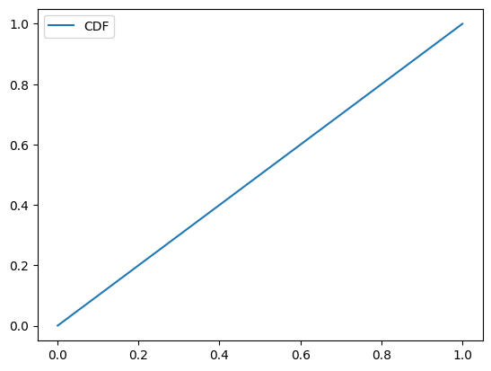
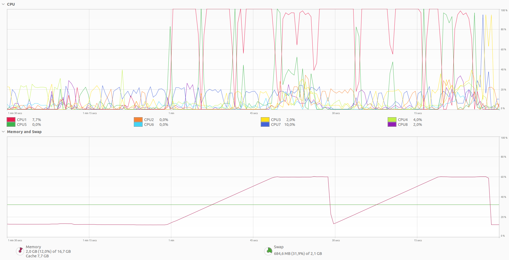

# Cloud and Edge Computing programming assignment P1 - Matrix Multiplication

Check top of `main.c` file for an example command to compile and run the matrix multiplication program.
For creating CDF check `plot.py`.

## Goal

Multiply the three matrices: A, B, and C;  i.e., you are expected to find the matrix D where D=(A\*B)\*C.
A, B, and, C contain random numbers in the range of (0,1) and the dimensions of the matrices are as follows.
 - A is a matrix with dimension 10^6 x 10^3.
 - B is a matrix with dimension 10^3 x 10^6.
 - C is a matrix with dimension 10^6 x 1.

## Report

### 1. Availability.
**A URL for the source code where your code is available. Please ensure that the code is documented. (0.5 point)**

https://github.com/JoakimJoensuu/cloud-and-edge-computing-p1-programming-assignment-matrix-multiplication

Code should document itself and it's not many lines of code.

### 2. Programming Language.
**Details on the choice of programming language you used, and the libraries. (0.5 point)**

For matrix multiplication I picked C language and used only standard library functions.

For creating CDF of matrix A I used Python with numpy and matplotlib libraries.

### 3. Methodology.
**Details of how the matrix are created and multiplied, and the techniques for evaluating the performance. (2 points).**

For each generated matrix height * width * 8 bytes worth of memory is allocated. Allocated memory is filled with random double-precision floating-point numbers within range [0, 1] using formula `((double)rand() / (double)RAND_MAX)`. For each generated matrix, its data was dumped into a file for later use.

In order to fit everything into memory, matrices are generated only when they are really needed and freed immediately after use. Since the matrices A and B were the largest and since the multiplication of the given three matrices is associative, to reduce the memory usage, the calculation D = (AB)C was changed to D = A(BC) [[0](https://en.wikipedia.org/wiki/Matrix_multiplication)].

Algorithm to perform multiplication is the most simplest one and it doesn't have any optimizations. It performs really bad compared to ready made functions that you can find from widely available libraries, like for instance Numpy. Generating random numbers is also really slow and makes up a large portion of the execution time.

I used `/usr/bin/time` program, which can be found at least from latest Ubuntu distributions, to see the running time and maximum memory usage of my program.

For visualizing memory and CPU usage I used System Monitor which is available in latest Ubuntu distributions.

### 4. Dataset.
**Plot a (empirical) cumulative distribution function (CDF) of all the values present in matrix A. What can you infer from the CDF? (2 points)**

Numbers are uniformly distributed.

### 5. Evaluation.
**Plot the time evolution of the memory usage, and CPU (and/or GPU) usage of your solution. What do you infer from the plots? (2 points)**

Generating matrices takes more time than calculating the results and memory isn't really allocated right after malloc is called, rather it's done after that memory area is being used.

Running the program took 56 seconds to run. According to `/usr/bin/time` maximum memory usage was 7837376 kbytes.

### 6. Discussion.
**Detail the various challenges encountered and how you addressed those challenges. If you are unable to obtain D, what is the largest size of the matrices for which you were able to compute D.  (3 points)**

Having A and B matrices in the memory at the same time was impossible. They both take about 8GB of memory so my laptop with 16GB of RAM couldn't handle that. To work around the problem multiplication was done by calculating B and C matrices first together, so calculating D = A(BC) instead of D = (AB)C.

## References

[0] [Wikipedia - Matrix_multiplication#Associativity](https://en.wikipedia.org/wiki/Matrix_multiplication)
